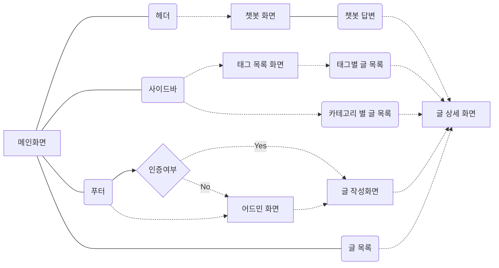
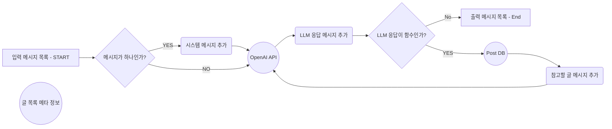

# Nextjs로 챗봇+블로그 만들기

## 블로그 flow

```mermaid
flowchart LR
Home[메인화면]
Sidebar(사이드바)
Header(헤더)
Footer(푸터)
List(글 목록)

    Home --- Header
    Home --- Footer
    Home --- Sidebar
    Home --- List

    Create[글 작성화면]
    Admin[어드민 화면]
    Chatbot[챗봇 화면]
    ChatbotResult(챗봇 답변)
    Detail[글 상세 화면]

    Athorize{인증여부}

    TagList[태그 목록 화면]
    Tag(태그별 글 목록)
    Category(카테고리 별 글 목록)

    Header -.-> Chatbot --- ChatbotResult -.-> Detail
    Sidebar -.-> TagList -.-> Tag -.-> Detail
    Sidebar -.-> Category -.-> Detail
    Footer --> Athorize -.->|Yes| Create -.-> Detail
    Athorize -.->|No|Admin
    Footer -.-> Admin -.-> Create

    List -.-> Detail

```

## Chatbot 답변 flow

```mermaid
graph LR
    Input["입력 메시지 목록 - START"]
    Output["출력 메시지 목록 - End"]
    LLM((OpenAI API))
    PostDB((Post DB))
    IsFirst{메시지가 하나인가?}
    System(시스템 메시지 추가)
    Response(LLM 응답 메시지 추가)
    IsFuction{LLM 응답이 함수인가?}
    PostResult(참고할 글 메시지 추가)
    PostListMetadata((글 목록 메타 정보))

    Input --> IsFirst
    IsFirst --> |YES|System --> LLM
    IsFirst --> |NO|LLM

    LLM --> Response
    Response --> IsFuction

    IsFuction --> |YES|PostDB --> PostResult --> LLM
    IsFuction --> |No|Output
```
